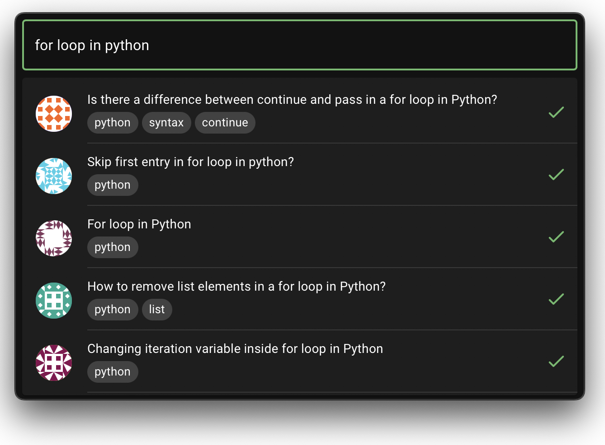

# Auxilium

Auxilium is an app built to look and feel like the spotlight app for mac,
but is made for developers, so you can find solutions on stack overflow faster!
## Features

- Light/dark mode toggle
- Dense/comfy settings
- Cross platform


## Installation

You can install the app by heading to [the latest release](https://github.com/codeaye/auxilium/releases/latest)
and downloading an appropriate version for your operating system.
    
## Keybindings
 - Show Auxilium - Alt + Space
 - Preferences   - Alt + P
 - Quit App - Alt + Q

*Not customisable yet

To hide a the search or preferences window, just click of it or focus on another app.
## Screenshots




## Build Locally

To do this, first clone the project

```bash
  git clone https://github.com/codeaye/auxilium
```

Go to the project directory

```bash
  cd auxilium
```

Install dependencies

```bash
  cargo install cargo-commander tauri-cli
```

Run the setup script

```bash
  cargo cmd setup
```

<details>
  <summary>To run in dev mode</summary>
  
  ### Developement mode
  ```bash
  cargo cmd dev
  ```
</details>

<details>
  <summary>To run in production mode</summary>
  
  ### Production mode
  ```bash
  cargo cmd build
  ```
</details>

## Acknowledgements

 - [Tauri](https://tauri.app/)
 - [React](https://reactjs.org/)
 - [MUI](https://mui.com/)
 
 ## License
 [MIT © codeaye](https://github.com/codeaye/auxilium/blob/main/LICENSE)
